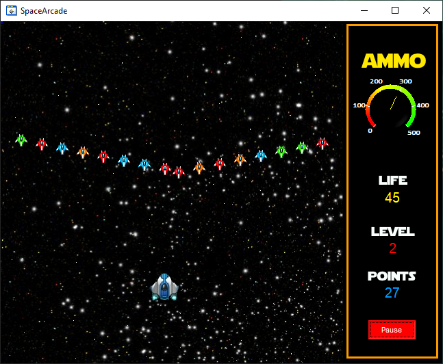

# Arcade
This is the final projet in Realtime Embedded course I took during my Degree.

### indroduction video:

[Introduction guide](https://youtu.be/KNqgvRG7JUo)

The program contains three panels:
Main panel, game panel and record table
### Main panel
Contains the following controls:
Game Start, inserting name and record table
### Main Game panel
Contains the main functions:
1. Running time
2. Draw 
3. File uploading

When the drawing function is the main function, it is made up of the following sub-functions:
  1. Background drawing in motion
  2. Game instructions
  3. Shots - General function shoot
        This function produces and produces shots for the spacecraft and other enemies.
        An ordinary enemy can only fire when the spacecraft and the enemy are facing each other plus repair
        Of the stay of time.
        The purpose of pausing time is to create a certain ease in the game.
  4. Hit validation
        Tests damage between bodies, spaceships and spaceships and between shots and spaceships.
  5. Promoting the player spaceship ship location
  6. Drawing the spaceship game ship draw
  7. Creating enemies
        This function produces enemies outside the canvas borders only when all the enemies are in attack
        The previous one was killed. There are different types of elves - different in color and amount of life.
        After two rounds of small enemies formed a different boss, there are three types of bosses. all
        A boss with a different life.
  8. GAME DATA game data update
        This function updates the points, life and amount of weapons and the state of progress in the game.
        Stops the game when the rest of the points or life are reset
  9. Adding life and weapons
        Produces and paints a drawing of a heart and a rifle bullet - during their assembly, life and shots will be added.
        When a rifle bullet is collected - in addition the spacecraft's weapon becomes faster and larger and more powerful.

### Table of records
Loads a csv file, and displays the peaks in the table.
Only after the function function will you update the file and save it.
